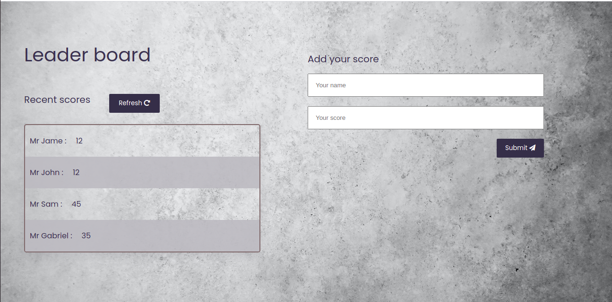

# leadership board


> In this activity I setup a JavaScript project for the Leaderboard list app, using webpack and ES6 features, notably modules. I develop a first working version of the app following a wireframe, but without styling - just focus on functionality. I consume the Leaderboard API using JavaScript async and await and add some styling.


## Screenshots:




Porject's features are added into seperate branch to keep dev safe.

## Built With

- HTML
- CSS
- JavaScript
- Webpack

## Online live link

[Visit project online](https://gbengacode.github.io/leaderboard-project/dist/)

## Getting Started

To get a local copy up and running follow these simple example steps.

### Prerequisites
 - A text editor(preferably Visual Studio Code)
### Install
  -  [Git](https://git-scm.com/downloads)
  -  [Node](https://nodejs.org/en/download/)
### Usage
  - Clone the repository using  ``` git@github.com:Gbengacode/leaderboard-project.git ```
  -  cd into the project folder
  -  Run ``` npm install ```
  -  Run ``` npm run build ```
  -  Run ``` npm start ```

## Visit And Open Files

[Visit Repo](https://github.com/Gbengacode/leaderboard-project)

## Download Repo

[Download Repo](https://github.com/Gbengacode/leaderboard-project/archive/refs/heads/dev.zip)

## Author


👤 **Emmanuel Gbenga**

- GitHub: [@githubhandle](github.com/gbengacode)

## 🤝 Contributing

Contributions, issues, and feature requests are welcome!

Feel free to check the [issues page](https://github.com/Gbengacode/leaderboard-project/issues).

## Show your support

Give a ⭐️ if you like this project!

## Acknowledgments

- Inspiration: Microverse


