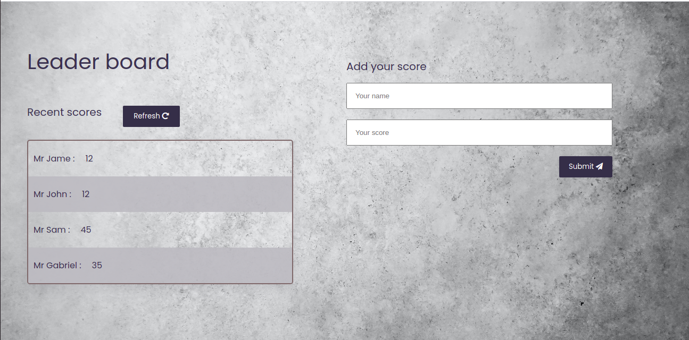

# leadership board

> In this activity I setup a JavaScript project for the Leaderboard list app, using webpack and ES6 features, notably modules. I develop a first working version of the app following a wireframe, but without styling - just focus on functionality. In following activities, you will consume the Leaderboard API using JavaScript async and await and add some styling.

## Screenshots:

Porject's features are added into seperate branch to keep dev safe.

## Built With

- HTML
- CSS
- JavaScript
- Webpack

## Online live link

[Visit project online](https://thecodechaser.github.io/awesome-books/)

## Getting Started

To get a local copy up and running follow these simple example steps.

## Visit And Open Files

[Visit Repo](https://github.com/Gbengacode/leaderboard-project)

## Download Repo

[Download Repo](https://github.com/Gbengacode/leaderboard-project/archive/refs/heads/dev.zip)

## Author

👤 **Emmanuel Gbenga**

- GitHub: [@githubhandle](github.com/gbengacode)

## 🤝 Contributing

Contributions, issues, and feature requests are welcome!

Feel free to check the [issues page](https://github.com/Gbengacode/leaderboard-project/issues).

## Show your support

Give a ⭐️ if you like this project!

## Acknowledgments

- Inspiration: Microverse

## 📝 License

This project is [MIT](./MIT.md) licensed.
